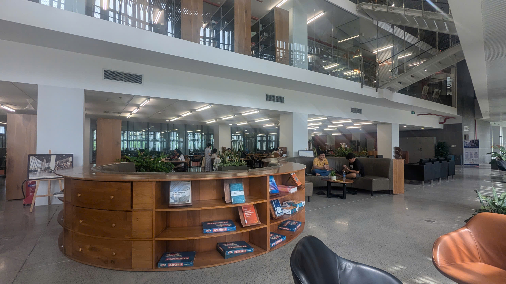

Sau [một thời cấp 3](https://callmeqan.github.io/posts/after-first-year-series/part-1-mua-thi-2024/) đầy sóng gió và buổi trại hè [UIT Bootcamp 2024](https://callmeqan.github.io/posts/after-first-year-series/part-2-uit-bootcamp-2024/) thì mình đã tới lúc vào đại học. Xác nhận thông tin trên bộ sau đó đi soạn đồ để lên Ký Túc Xá (KTX)

## Đăng ký KTX

Bên KTX mở đơn đăng ký phòng từ 27/7 đến 4/8. Nhìn vào hình ảnh của google form thì thấy khá là được, đên khi nhận phòng thì đúng thật nó giống vậy, chỉ là dơ hơn thôi :))))

Cái hài ở chỗ là mình điền thông tin kèm là *ưu tiên phòng hướng về Nam, Bắc hoặc Đông* và kiểu phòng:

Thế mà lúc nhận phòng thì bên KTX cho cái phòng dell có máy lạnh với hướng Tây. Lúc đó mẹ mình đi chung cay quá trời :)))))

Hôm 16/08 thì mình nhận được email thông tin phòng mình sắp tới là 550 Tầng 5, KTX 1 (Cam) với bạn cùng phòng sắp tới là Nguyễn Thanh Huy. Cùng với mail đó là link điền thông tin xác nhận và chọn ngày chuyển vào là 28/8, ngoài ra trong cái google form còn 2 ngày welcome new intake24 là 7/9 và 8/9.

## Ryan Nguyễn và Minhkeke

Hồi đó trước khi nhập học thì trường mình có [group facebook](https://www.facebook.com/groups/vgufreshmen), trong đó có chat cộng đồng, mà hồi đó sôi nổi lắm, trước khi nhập học mà mỗi ngày 300-400 tin nhắn, chủ yếu là làm quen với chơi game.

Đặc biệt là có Bộ trưởng Bộ Ngoại Giao năm 1 [Ryan Nguyễn](https://www.facebook.com/ryancpp/)

Thg này nó ngày nào cũng đi spam tin nhắn, nhắn tin đủ thứ xong qua ngành khác cũng chat chit, rồi làm quen thêm bộ trưởng ngoại giao khác [Đạt](https://www.facebook.com/lucas.nguynnn). Xong hai đứa về chung phòng KTX luôn :))))))))

Xong lòi ra thêm ông [Minhkeke](https://www.facebook.com/minh.eisenhower) chuyên đi phân biệt vùng miền nên 2 ông thân ngoại giao của năm nhất CSE này mà cả mấy anh chị năm 2, 3 biết hết.

Đến lúc gần nhận phòng là lòi ra group CSE Đa thế hệ (đặt là vậy thôi chứ toàn năm 1)

## Nhận phòng

Ngày 28/8 mình đi rất sớm từ 5h30 cùng với ba mình và một đống đồ. Mặc dù lên đi rất sớm nhưng vô đó làm quy trình rất lâu và dài, ngồi ký 4 cái tờ giấy và chờ chìa khóa phòng.

Ba mình thấy lâu quá nên cho mình ở lại và đi làm trước, mình thì ở lại lấy phòng và ở chơi đến chiều tối.

Lúc đó điền giấy xong thì mình được dẫn lên phòng 550, mở phòng kiểm tra tình trạng phòng rồi kí tên xác nhận bàn giao chìa khóa phòng. Nằm ngồi loay hoay chút thì xong, chán quá nhắn tin lên group hỏi có ai đang ở trường không. Thế thì có anh trai Ngọc Minh (béo), phòng ngay dưới đít luôn gặp nhau lần đầu tiên.

## Thư viện và bida

Lúc đó mình với Minh đi vòng vòng quanh trường từ ktx cam đến căn tin rồi qua thư viện. Thư viện mà nó to với đẹp vãi!

Bị cái là ít sách, toàn sách cổ không, nhưng là có bộ sách [The Art of Computer Programming](https://en.wikipedia.org/wiki/The_Art_of_Computer_Programming) tuyệt vời của ông Donald Knuth nên bù lại cũng được (hình như ít ai đọc). Ngoài ra thì tầng 3 có nguyên khu thesis của các anh chị năm trước đi ra nên lấy nó ra đọc cũng vui

Ngoài ra mình được nghe nói là phía sau lưng trường có quán bida, tra bản đồ thì có *"Câu lạc bộ Bida Giang Đen"*. Cho đến khi mình với thg Minh đi ra sau trường và kiếm nó, lẽ ra là đell phải, quán đó là quán cũ vcl, hợp nhất với *"Cafe bất động sản Mai Giang rồi"*

Đcm đi bộ dài vcl, đi một vòng xuống Giang đen xong ngược lên N1 để đến Mai Giang. Lúc đến thì trời chiều rồi nên mình với Minh đi về lại ktx, trên đường về thì gặp thg Phúc, cũng làm quen trước qua group mes kia, xong rồi nói chuyện một hồi mới biết 3 thg sẽ học chung lớp tiếng đức, ảo vcl.
