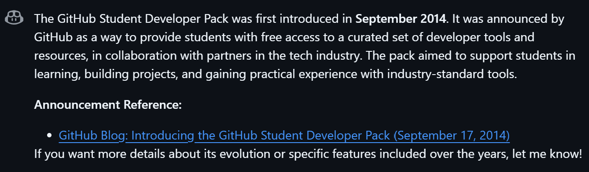

Với việc bạn đã bước vào năm nhất đại học, đặc biệt là các bạn ngành IT nói chung, gói [Github Student Developer Pack](https://education.github.com/pack) sẽ hỗ trợ các bạn rất mạnh trong 4 năm sắp tới. Mình thời điểm viết bài blog này đã qua năm nhất đại học và mình sẽ giới thiệu cho các bạn về gói này và cách sử dụng hiệu quả nhất!

## Thông tin chung

Gói [Github Student Developer Pack](https://education.github.com/pack) được lần đầu giới thiệu vào tháng 8 năm 2014, theo như copilot trả lời.

Trong nhiều năm nay, Github đã liên tục cập nhật thêm nhiều nhà tài trợ mới, nhiều công cụ và tài liệu mới và hay cho các bạn sinh viên. Nổi bật nhất kể đến là JetBrains, Namecheap (đăng ký tên miền) hay mới nhất là truy cập vào Github Copilot hoàn toàn miễn phí với các model mạnh như GPT-4.1, Gemini 2.5 Pro, Claude 3.5-Pro.

Để đăng ký thành công gói này thì bạn cần:

- Hình chụp thẻ **sinh viên** (*lưu ý là thẻ học sinh có thể không được*)
- Cập nhật profile Github thông qua [Github Settings](https://github.com/settings/profile), bao gồm: Tên thật, Ngày-tháng-năm sinh, Ảnh profile (*không được để ảnh mặc định?*)

Sau đó chờ khoảng 1-2 tuần là có kết quả, mình từng bị từ chối 3 lần liên tục do thông tin không trùng khớp.

## Review các ưu đãi bên trong

### Developer Tools (vdu như IDE, Application, Platform,...)

Mấy cái hay ho như:

- Free **Github Pro**, cái này rất lời nha, cho Pro tận 4 năm nên tận dụng nó thật kĩ vào.

:::caution
Lưu ý, đây chỉ là Github Pro **for Personal** thôi nha, nếu bạn có một team mà tạo organization thì nó không có bản Team hay Enterpise đâu.
:::

- Tất cả sản phẩm của **JetBrains**, bạn sẽ phải dùng nó khi học đến mấy môn như code app android, ios hay IoT. Dùng sản phẩm của công ty này rất nghiện nha, nó automate hết mọi thứ, setup project hoàn chỉnh mà không cần phải lo đến vấn đề bất đồng phiên bản hay debug không được.

- **Github Page**, free 1 trang, có thể host từ repo của bạn hoặc của organization. Như trang web blog này của mình

::github{repo="CallMeQan/CallMeQan.github.io"}

- **GitLens**, cái này mình chưa dùng bao giờ nhưng được mọi người khen nó rất nhiều.

- **Termius**, SSH Client, điều khiển máy ảo, máy chủ hoặc chiếc laptop từ xa (nếu bạn giàu).

- **Travis CI**, DevOps tool.

Còn nhiều nữa mà toàn mấy công cụ lạ mình chưa dùng tới.

### Cloud

Có 3 thg dùng nhiều nhất là [Heroku](heroku.com), [Microsoft Azure](https://azure.microsoft.com/) với [DigitOcean](https://www.digitalocean.com/).

Mình mới dùng Heroku thôi, Azure thì bằng cách thần kì nào đó nó bảo vùng VN mình không hợp lệ nên mình đăng ký quài không được.

### Design

Có [Bootstrap Studio](https://bootstrapstudio.io/) nhìn có vẻ hay nhưng mình chưa thử, phần còn lại thì không biết vì mình không phải dân frontend hay designer.

Bên ngoài Github Student Developer Pack thì mình có [Figma For Education](https://www.figma.com/education/) nhưng mà quy trình đăng ký nhanh với gọn hơn.

### Domain (Quan trọng nè)

Mình được tặng 3 dịch vụ gồm [Namecheap](https://www.namecheap.com/), [Name.com](https://www.name.com/) và [.Tech](https://get.tech/)

Mỗi cái được tặng 1 năm dùng nên dùng từng cái thôi, tất nhiên là tụi nó không cho mình tên miền `.com`, `.net` với `.org` vì đó là tên miền cao cấp.

### Infrastructure & APIs and IoT

Internet of Things:

- [Arduino Cloud](https://www.arduino.cc/education/github-students) 6 tháng và giảm giá các sản phẩm IoT.
- [AdaFruit IO+](https://www.adafruit.com/github-students) 1 năm và giảm giá các sản phẩm IoT.

Infrastructure & APIs:

- [MongoDB](https://www.mongodb.com/students), \$50 in MongoDB Atlas Credits, MongoDB Compass and MongoDB University including free certification valued at \$150.
- [Stripe](https://stripe.com/), API giống như PayPal vậy đó, nhưng mình được dùng miễn phí.
- [CryptoLens](https://cryptolens.io/), đóng gói sản phẩm và đăng ký bản quyền + đem bán nó hợp pháp????

Và còn nữa...

### Learning

:::caution
Lưu ý, mình đánh giá dưới góc nhìn của người học code từ cấp 2 tới giờ và code rất nhiều mảng khác nhau nha. Hơi bias nhưng không sao.
:::

- [Educative](https://www.educative.io/), tặng mấy khóa học chủ yếu về web, có khóa python, java cơ bản, còn lại như shiet
- [DataCamp](https://www.datacamp.com/), dành riêng cho các bạn học AI/ML, Data Engineer, Analyist, Scientist...
- [Codedex](https://www.codedex.io/), web trẻ con, vẫn là mảng web development.
- [Scrimba](https://scrimba.com/home), chỉ có frontend, pass...
- [FrontendMasters](https://frontendmasters.com/), welp, tiếp tục là web development.
- [Microsoft Visual Studio Dev Essentials](https://visualstudio.microsoft.com/dev-essentials/), này bao gồm các tool hỗ trợ việc học, khá hay khi mà nó có các khóa cloud miễn phí.
- [AlgoExpert](https://www.algoexpert.io/), Leetcode trái hình nhưng có hỗ trợ học cấc thuât toán.
- [GoRails](https://gorails.com/), Ruby On Rail!!!!
- [Thinkful (chegg)](https://www.chegg.com/skills/), này hơi sú vì trang web đổi chủ rồi.
- [SymfonyCasts](https://symfonycasts.com/), 2025 rồi, Php chết rồi :))

- [InterviewCake](https://www.interviewcake.com/), Leetcode trái hình nhưng nó thêm câu hỏi ngoài về cá tính?

Phần lớn ở đây mình không đụng tới, mới thử Datacamp, Educative với Microsoft thôi.

Mình khuyên các bạn có thể học miễn phí thông qua Youtube, Reddit hay StackOverFlow. Vấn đề hiện nay của giới trẻ là không biết đọc Document của tool mình đang dùng, toàn là AI làm giùm đâm ra mỗi lần không có AI là như người dưng không làm.

### Productivity

- [Notion Plus](https://www.notion.so/githubstudentpack), welp, biết dùng thì rất hiệu quả vãi.
- [SlideCoach](https://www.slidecoach.ai/en), soạn slide thuyết trình??? Lên tận 40 slides???
- [ToDiagram](https://todiagram.com/), cái này khá hay, mình chưa thử vì không biết nên dùng vào việc gì.

### Security

Đặt tên category là Security nhưng ở đây tool chủ yếu dành cho các bạn theo DevOps hoặc Cloud Engineer, vài tools trong đây dùng nhiều khi ra doanh nghiệp làm việc.

## Cách tận dụng Github Student Developer Pack tốt nhất

### 1. Chọn mục tiêu sau khi tốt nghiệp

Bạn có tận năm nhất để học làm đủ thứ rồi xác định hướng đi của mình, tùy vào hướng đi sẽ có:

- **Web Developement**: Có mấy tool như Figma, Bootstrap Studio hay host website như Heroku, Azure, thậm chí Github Pages cũng là bước khởi đầu của bạn.
- **Mobile Development**: Tập trung vào sản phẩm của JetBrains hoặc chơi trội hơn thì React Native hay Tauri cross-platform với Javascript (làm ơn đừng).
- **AI/ML**: Có chỗ học miễn phí như Datacamp với Microsoft Azure, dùng Azure để chạy model hoặc Google Colab.
- **Cloud/DevOps**: Github Action, GitKraken hay Travis CI...
- **IoT**: Arduino thẳng tiến!

#### Làm sao để biết mình thích gì?

Trong vòng 1 năm học thì bạn làm nhiều project hết mình. Sau đó kết thúc năm thì nhìn lại xem mình đã làm project gì, các project đó có đặc điểm chung là gì rồi đưa ra kết luận. Biết mục tiêu của mình sẽ tốt hơn là sống qua 4 năm đại học mà không có mục tiêu.

### 2. Master những tool quan trọng trước

Vì bạn mới vào đại học nên sẽ có tiềm thức đi tìm hiểu và dùng nhiều thứ nhất có thể, đừng! Hãy tập trung vào cốt lõi những thứ sẽ theo bạn cả đời như:

- **Git & Github** sẽ là nơi bạn lưu code và làm việc cùng với mọi người
- **Visual Studio Code và các IDE**, bạn dùng nó để code nên chọn cẩn thận, chơi lớn thì NeoVim :))
- **Nguồn học** để phát triển bản thân mình.

### 3. Bơi vào các trang web dạy học miến phí

Theo Web Dev thì có Educative ngon.

Theo Cloud thì Microsoft Azure Dev Essentials miễn phí.

Theo AI/ML thì có Datacamp tốt nhất!

:::tip
Đừng học cùng lúc nhiều quá, trừ khi bạn là siêu nhân. Học từ từ thôi vì bạn có nhiều thời gian.
:::

### 4. Làm project liên tục

Sau 1 năm để xác định mình theo gì thì lúc đó bạn sẽ làm project về mảng đó, ứng dụng những gì mình học vào project và đút kết kinh nghiệm học.

Đi xung quanh, lướt fb hay báo để tìm kiếm ý tưởng, đôi khi những lúc bạn cay thứ gì đó thì bạn sẽ làm ra solution để giải quyết nó. Ý tưởng cơ bản nhất là Personal Website như trang này bạn đang đọc :)))

### 5. Học nữa, học mãi, học suốt đời

Tham gia vào các Community như Google Developer Group, Github Campus. Tham gia các câu lạc bộ học thuật cũng là điểm cộng rất lớn trong hồ sơ của bạn.

## References

- [Hasanul Banna Himel on Linkedin](https://www.linkedin.com/pulse/maximizing-your-github-student-developer-pack-guide-free-himel-ojzwc/)
- [Github Copilot](https://github.com/copilot) vì đã cho thông tin ngày sinh của gói này :))
