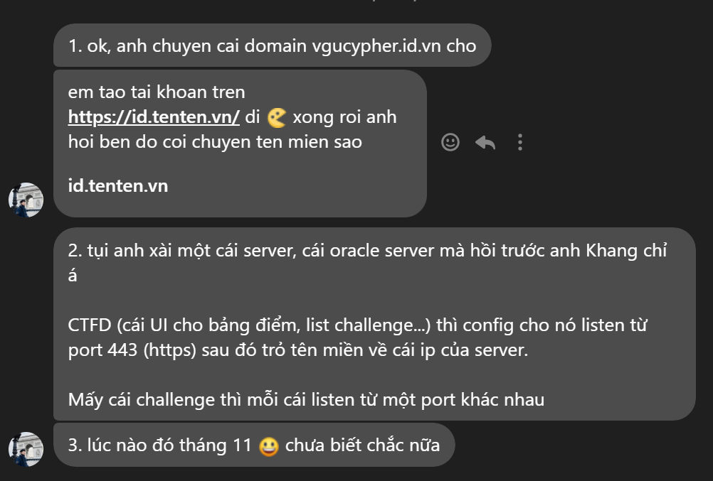
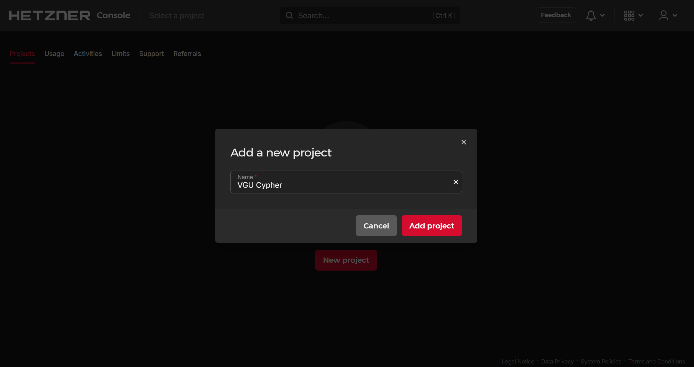
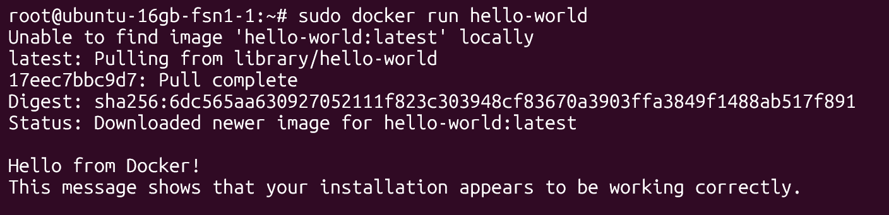
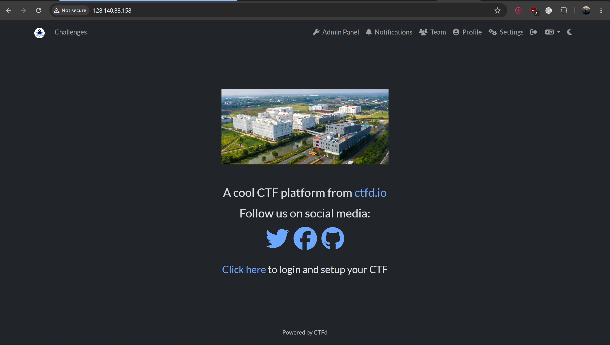
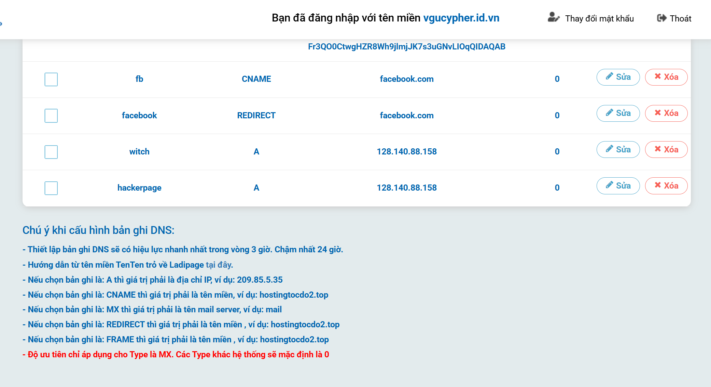

Thật sự này sẽ là thứ tiếp diễn sau sự kiện mình lên chức chủ tịch [CLB VGU Cypher](https://www.facebook.com/vgu.cypher) của nhiệm kỳ 2025-2026, với kế hoạch từ hồi hè thì mình có trọng trách là thực hiện nó và các nguyện vọng ban đầu của các anh founder!

Đợt CTF kỳ này đầu năm tên là **VGU CTF Beginner 2025: Waldschrein - The Lost Capture The Flag**. Mình đảm nhận vai trò là server administrator và anh [**Khavid**](https://khavidbap.github.io/) sẽ là người gom thu các challenges cho sự kiện và là bot first blood chạy bằng cơm :troll:

Tính ra mình cũng vận dụng được tí kiến thức docker của mình để quản lý mấy challenge về web và pwn là chủ yếu.



## Deploy trang web chính bằng CTFd

Trước khi lên production thì mình có tìm hiểu qua thử bên trang web [document CTFd](https://docs.ctfd.io/docs/deployment/installation/) thì thấy nó không khó lắm, nhưng cho đến khi vào làm thì mệt mỏi vcl!

### Tìm tên miền

Cái này thì mình đi mượn lại các anh tiên bối cũ tên miền vgucypher.id.vn mua trên trang [tenten.vn](https://tenten.vn/) nên cũng nhanh, nhờ anh Phú transfer tên miền sang email mình là xong!

Nhưng mà đến tuần diễn ra sự kiện thì trang tenten nó sập lên sập xuống làm mình không custom được subdomain cho mấy challenges 🤬

### Tìm kiếm cloud server

Việc tìm kiếm server thì mình hướng đến 3 sự lựa chọn:

- Xin sponsor từ **Google Cloud**
- Mua dịch vụ của **Hetzner** siêu rẻ của Đức
- Xài trick 100$ Oracle miễn phí của anh Benasin :))

Ở cái option 1 thì mình thấy rằng giải của mình nó phải public kiểu liên trường thì thg google mới sponsor, chứ để trong trường thì ai cho?

Còn option 3 thì trick đó khá tốn tiền (tận 100$ 💀) nhưng mà vẫn back lại sau đó, nhìn khá là tốn tiền và không liêm chính cho lắm

Vì thế mình đến với option 2 là mua cloud server của Hetzner với cấu hình là 4 vCPU, 16 GB RAM và 100 GB SSD với băng thông tận 10TB chỉ với 10$ cho 14 ngày. Một phần lý do là mình cũng có phần tài trợ của VSA tận 500k nên không lo lắm, chủ yếu kiếm lời dựa trên phần này?

#### Mua server khá là nhanh?

Thật lúc đầu mình tạo acc trên trang Hetzner khá tốn thời gian, bởi vì để tạo và xài server thì bên đức hay **EU khá strict việc thẻ hay tài khoản ngân hàng** mình phải có liên kết với Visa hay Mastercard, mình thì có VCB Visa everlink nên chả sao, bằng cách nào đó Paypal nó không cho mình kích hoạt cái Paypal bằng sđt 💀

Sau đó mình vào trang [console.hetzer.com](https://console.hetzner.com/projects) để đăng nhập lại và tạo project:



Sau khi tạo project thì chúng ta sẽ có nhiều tab khác nhau như là **Server** (Tạo và quản lý server), **Volumes** (Mua thêm dung lượng ảo), **Floating IPs** (này mình ko biết :L), **Firewall** (setup firewall nhưng trong ctf thì không cần lắm), **Load Balancing** (mình cũng không dùng luôn), **DNS** (dns stuff), ...

Trong phần Server thì mình tạo server nó với cấu hình là **4 vCPU, 16 GB RAM**:


Nhưng vấn đề là làm sao để biết mình cần server to cỡ bao nhiều ư?

| Tình huống (50–60 players) | Số web | Pwn connectable | Crypto connectable | Recommend (single server) |
|---|---:|---:|---:|---:|
| Nhẹ — no bots, chỉ web static + pwn cơ bản | 4–6 | 4–6 | 0–2 | 2 vCPU, 8 GB RAM |
| Thường — nhiều web dynamic, 1 bot/flag cho vài challenge | 4–6 | 4–6 | 0–2 | 4 vCPU, 8–16 GB RAM |
| Nặng — nhiều bot 24/7, nhiều pwn có fork/spawn processes | 6+ | 6+ | 2+ | 4+ vCPU, 16+ GB RAM (hoặc tách thành 2 server) |

Kỳ CTF này mình chỉ có 5 bài pwn cơ bản, 4 bài web với 2 bài crypto thôi mà mình thuê tận 16GB RAM thấy phí vcl!

Hetzner có nhiều loại plan; hourly/monthly và giá thay đổi theo dòng máy (CX/CCX/CCX23...). Một số gói shared vCPU 4 vCPU / 16 GB có giá hourly ~0.04 €/hr (mốc tham khảo, sẽ thay đổi theo region và thời điểm). Đợt này mình mua lúc nó còn \$0.004 / hr nên tổng phí cho CTF này của mình chỉ có **$9.88 cho 14 ngày**

:::tip
Mấy kỳ CTF beginner thì mua 2-4 vCPU với 8GB RAM là quá đủ r
:::

#### Giải thích số liệu (vì sao thế)

- **CPU:** pwn connectable + scoring + CTFd + nginx reverse proxy đều cần CPU; 2 vCPU đủ cho load nhẹ, nhưng khi players kết nối đồng loạt và nhiều container hoạt động thì 4 vCPU mang lại headroom.  
- **RAM:** phần lớn web challenge nhẹ (10–30 MB/container). Bot “admin” để act on player input thường tốn ~100 MB mỗi instance — nếu bạn có nhiều challenge động active cùng lúc thì RAM tăng nhanh. 8 GB ram đủ cho cấu hình cân bằng; 16 GB nếu bạn muốn tránh swap khi nhiều bot hoạt động đồng thời.
- **Tách dịch vụ:** nếu thấy server “toang” lúc peak, tách scoring/CTFd + database lên một instance riêng (nhẹ, 2 vCPU/4GB) và để challenge containers trên instance khác để phân tán I/O/CPU.

#### Connect đến server

Mình mua xong thì bên Hetzner sẽ gửi cho mình password của root, cứ thế mình cứ connect thông qua SSH thôi, ở đây mình dùng [Termius](https://termius.com/) cho nó dễ vì nó tích hợp luôn chức năng upload / download file từ server về

#### Tải Docker và host CTFd

Ta cứ theo docs của Docker Official mà chơi thôi. Mạng mẽo lúc buổi tối tệ quá nên mình tốn tận 1 tiếng để tải docker lên server



Sau đó mình cứ làm theo hướng dẫn của CTFd mà deploy lên được thôi



### DNS và Cert

Phần này mình thật sự không biết miêu tả sao nhưng mình dùng [CertBot phiên bản pip](https://certbot.eff.org/instructions?ws=nginx&os=pip) để generate thôi, chứ không có gì nhiều.

Nhờ có certbot mà website mình có SSL certificate để hô biến `http://` thành `https://` cho nó uy tín!

Ngoài ra CTF của mình có challenge tên là `Witch's Broadcast` của RSA stuff, lúc này mình về lại trang tenten.vn để thêm A Record mới là `witch.vgucypher.id.vn`



Trong diễn ra event thì trang tenten thì nó gặp sự cố khiến việc thay đổi DNS không được, vì lý do đó nên toàn bộ chall của wave 2 & 3 của mình nó không có custom name được như `math.vgucypher.id.vn` hay `hsr.vgucypher.id.vn`

## Deploy các challenges?

Phần này cũng khá dễ thôi vì mình dùng Docker và thêm tí compose, chỉ có mấy chall như web, pwn là mình cần config. Đưa ra ví dụ bài `Hackershop`, nó rất là hiển nhiên vì mình không cần đưa source ra mà player chỉnh giá tiền xuống âm là có được flag, deploy server của mình sẽ là:

```dockerfile
FROM python:3.9-slim

WORKDIR /app
COPY requirements.txt .

RUN pip install --no-cache-dir -r requirements.txt

COPY . .

ENV FLASK_APP=app.py
EXPOSE 5000

CMD ["flask", "run", "--host=0.0.0.0"]
```

Nhưng mà để tiện hơn thì mình tạo thêm file `docker-compose.yml` vì khi bạn chạy lệnh `docker compose up -d` là nó vừa tự động build + chạy image luôn. Thêm flag `-d` là detacted tách ra chạy background tốn chỉ 10-30mb ram thôi.

```yaml
version: '3.8'
services:
  flask-app:
    build: .
    ports:
      - "3001:5000"
    environment:
      FLASK_ENV: development
```

Khi mà bạn làm mấy chall deployable đó thì nhớ làm một cái sheet để lưu coi chall nào đã được blind vào port nào để mình còn biết là port này của chall đó.

Mình có deploy một cái chall pwn là `math` nhưng nó cho output bị weird nên khi bên Hetzner quét thì nó cảnh báo mình port này bị lỗi nên cẩn thận, mình cũng chả quan tâm nên cho qua thôi :))
