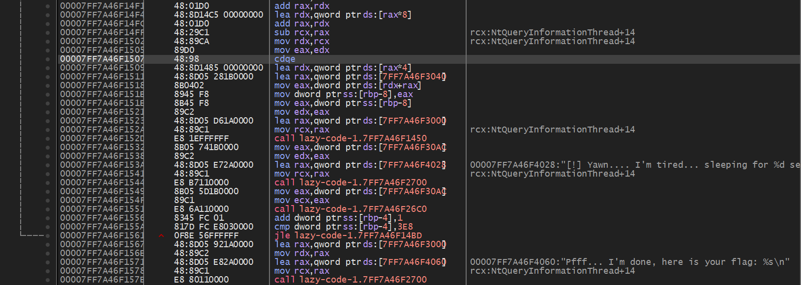
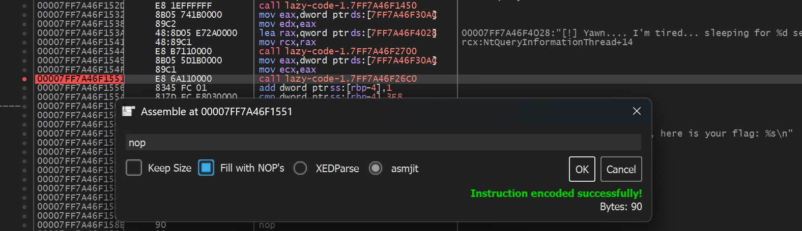
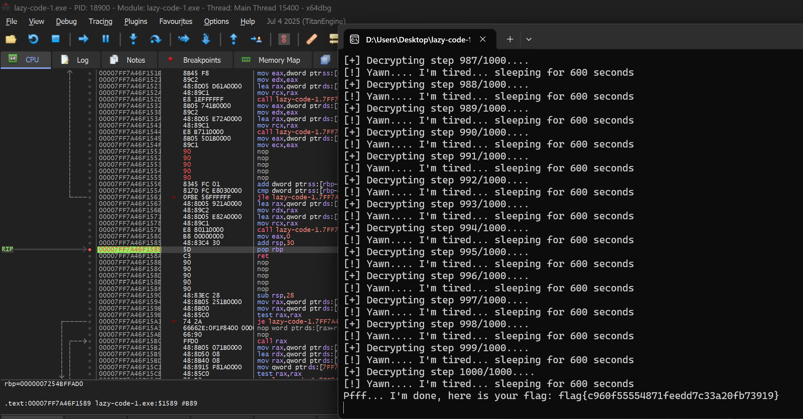
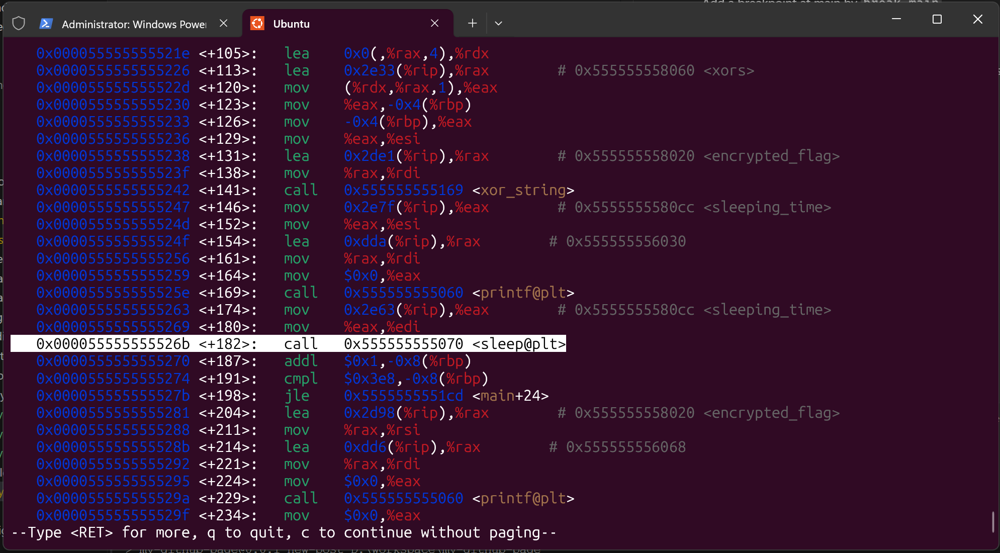

## Lazy Code 1.0

This chall give us a `lazy-code-1.exe` file, so I straight up open dotPeek from Jetbrains to see inside. Turn out there're nothing here and dotPeek unable to decompile this.

So I open the Ghidra to see inside, right at main:

```c
int __cdecl main(int _Argc,char **_Argv,char **_Env)
{
  uint local_c;
  __main();
  for (local_c = 1; (int)local_c < 0x3e9; local_c = local_c + 1) {
    printf("[+] Decrypting step %d/1000....\n",(ulonglong)local_c);
    xor_string(0x140003000,
               (byte)*(undefined4 *)
                      (&xors + (longlong)
                               (int)(local_c +
                                    (int)((ulonglong)(longlong)(int)local_c / 0x1b) * -0x1b) * 4) );
    printf("[!] Yawn.... I\'m tired... sleeping for %d seconds\n",(ulonglong)sleeping_time);
    sleep(sleeping_time);
  }
  printf("Pfff... I\'m done, here is your flag: %s\n",&DAT_140003000);
  return 0;
}
```

Analyzing this we find it slow down by `sleep(sleeping_time)`.

**So the direction here is to skip the function `sleep`!**

I did some google search and come by a tool name [x64dgb](https://x64dbg.com/). This tool support Windows debugging and disassembler! I put the file into this, scroll entire page alot until I found the code:



At first I didn't know anything and don't know how to read this so I assume that `call lazy-code-1.7FF7A46F2700` is `printf` and I was right.

Then the function right after `printf("[!] Yawn...")` must the sleep function!

And so I edit the instruction of that with `nop`:



Oh, remember to set a breakpoint at almost the end of main function, right before `ret`! Then run!



`flag{c960f55554871feedd7c33a20fb73919}`

## Lazy Code 2.0

:::tip
The continue version is easier than first one if you are familiar with Linux Reversing than Windows Reversing.
:::

Just put the `lazy-code-2` in Linux or WSL like me, then run `gdb ./lazy-code-2`.

Add a breakpoint at main by `break main`.

Type `run` and it will stop at entry of main

To disassembles the main function, run `disass`, press Enter till you found the sleep function:



Here we found this address `0x000055555555526b` is calling sleep function. So we set this to NOP to skip these:

```bash
(gdb) set {unsigned char} 0x55555555526b = 0x90
(gdb) set {unsigned char} 0x55555555526c = 0x90
(gdb) set {unsigned char} 0x55555555526d = 0x90
(gdb) set {unsigned char} 0x55555555526e = 0x90
(gdb) set {unsigned char} 0x55555555526f = 0x90
```

Then type `continue` and you get the flag!

`flag{b3fda416daebdef7a5d79deb07c43375}`
